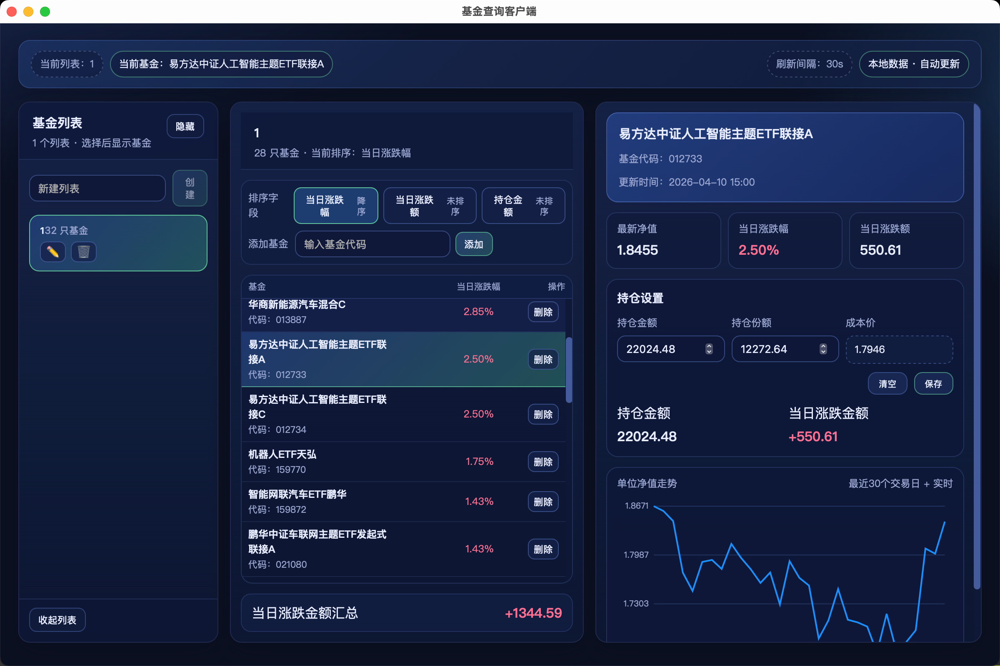

# 📈 基金查询客户端 (Leek Fund)



一个基于 Tauri + Rust + React 构建的跨平台桌面应用，用于查询、管理中国基金信息。

## ✨ 功能特性

- 🔍 **基金搜索**: 输入 6 位基金代码实时查询，自动校验格式与错误提示
- 📝 **多列表管理**: 创建/重命名/删除自定义基金列表，单列表内自动去重
- 🧭 **三列布局**: 左侧切列表，中间即时展示该列表的基金（代码/名称/当日涨跌），右侧详情含基础信息与走势图，空态提示友好
- 💰 **持仓金额**: 在基金详情页按“分组+基金”设置或清空持仓，自动计算并展示当日涨跌金额
- ➕ **智能添加**: 当目标基金已在列表时，下方列表自动过滤只展示该基金，避免重复并可一键恢复全量
- 💾 **本地持久化**: 数据写入 `SQLite`，启动自动迁移旧 `lists.json`，数据库损坏时自动备份后重建
- 🤖 **AI 对话 Tab**: SSE 流式回复，自动创建/续写最近会话，消息与会话持久化到 SQLite，失败有重试提示
- 🔁 **自动刷新**: 基金数据周期性自动刷新（约 1–5 分钟，可按需求调节频率）
- 🎨 **现代UI**: 响应式布局，包含空态/错误提示与基础快捷操作

## 🚀 快速开始

### 前置要求

- Rust 1.70+ ([安装 Rust](https://www.rust-lang.org/tools/install))
- Node.js 18+ ([安装 Node.js](https://nodejs.org/))
- 操作系统: macOS, Windows, 或 Linux

### 安装依赖

```bash
# 安装前端依赖
npm install

# Cargo 会自动处理 Rust 依赖
```

### 开发模式运行

```bash
npm run tauri:dev
```

这将启动前端开发服务器和 Tauri 应用窗口。前端支持热重载。

### 生产构建

```bash
npm run tauri:build
```

构建产物位置：
- **macOS**: `src-tauri/target/release/bundle/macos/`
- **Windows**: `src-tauri/target/release/bundle/msi/`
- **Linux**: `src-tauri/target/release/bundle/appimage/`

## 📚 技术栈

### 后端 (Rust)
- **Tauri 1.5**: 跨平台桌面应用框架
- **reqwest**: HTTP 客户端
- **serde/serde_json**: 序列化/反序列化
- **tokio**: 异步运行时
- **uuid**: UUID 生成
- **chrono**: 时间处理
- **SQLx + SQLite**: 本地数据库访问与迁移

### 前端 (React)
- **React 18**: UI 框架
- **TypeScript**: 类型安全
- **Vite**: 构建工具
- **SSE 流式处理**: AI 对话 Tab 通过 SSE 展示增量回复

## 🏗️ 项目结构

```
leek-fund/
├── src/                      # 前端源代码
│   ├── components/           # React 组件
│   ├── hooks/                # 自定义 Hooks
│   ├── types/                # TypeScript 类型
│   ├── App.tsx               # 主应用组件
│   └── main.tsx              # 入口文件
├── src-tauri/                # Rust 后端
│   ├── src/
│   │   ├── modules/          # 核心模块
│   │   │   ├── fund_api.rs   # 基金 API
│   │   │   ├── storage.rs    # 数据持久化
│   │   │   └── list_manager.rs # 列表管理
│   │   ├── models.rs         # 数据模型
│   │   ├── errors.rs         # 错误类型
│   │   ├── commands.rs       # Tauri 命令
│   │   └── main.rs           # Rust 入口
│   └── Cargo.toml            # Rust 依赖
├── specs/                    # 设计文档
└── package.json              # Node 依赖
```

## 🔧 开发指南

### 运行测试

```bash
# Rust 后端测试
cd src-tauri
cargo test

# 前端测试（如果配置）
npm test
```

### 代码格式化

```bash
# Rust
cd src-tauri
cargo fmt

# TypeScript/React
npm run format
```

### 调试

- **Rust 后端**: 使用 `println!` 或 `dbg!` 宏，输出会显示在终端
- **前端**: 使用浏览器开发工具（在 Tauri 窗口中按 `Cmd+Option+I` / `Ctrl+Shift+I`）

## 🗄️ 数据存储

- 默认存储文件：应用数据目录下的 `lists.sqlite`（旧版数据位于同目录的 `lists.json`）
- 启动时如果检测到 `lists.json` 且数据库为空，会自动迁移到 SQLite，并将原文件重命名为 `lists.migrated.json`
- 如果数据库损坏，应用会自动备份为 `lists.backup.{timestamp}.sqlite` 后重建空库
- 路径示例：
  - macOS: `~/Library/Application Support/leek-fund/`
  - Windows: `%APPDATA%/leek-fund/`
  - Linux: `~/.local/share/leek-fund/`

## 📖 API 接口

### 基金数据来源

- **基金实时数据**: `http://fundgz.1234567.com.cn/js/{code}.js`
- **基金历史走势**: `https://fund.eastmoney.com/pingzhongdata/{code}.js`
- **返回格式**: JSONP (`jsonpgz({...})`)

### Tauri 命令

- `search_fund(code)`: 搜索基金
- `get_all_lists()`: 获取所有列表
- `create_list(name)`: 创建列表
- `add_fund_to_list(list_id, fund_code)`: 添加基金
- `remove_fund_from_list(list_id, fund_code)`: 移除基金
- 更多详见 [API 契约文档](specs/000-fund-list-management/contracts/tauri-commands.md)
- 其它契约：
  - 三列布局/详情接口: `specs/002-fund-detail-layout/contracts/openapi.yaml`
  - SQLite 存储接口: `specs/003-sqlite-storage/contracts/openapi.yaml`
  - AI 对话 SSE 接口: `specs/006-ai-chat-tab/contracts/openapi.yaml`
  - 添加过滤接口: `specs/007-fund-add-search/contracts/fund-list.openapi.yaml`

## 📝 功能使用

1. **搜索基金**: 在搜索框输入6位基金代码（如 `001632`）
2. **创建列表**: 在左侧面板输入列表名称并点击"创建"
3. **添加基金**: 搜索到基金后，选择目标列表并点击"添加到列表"
4. **三列浏览**: 左侧选列表 → 中间查看基金（含当日涨跌）→ 右侧查看详情与走势图
5. **持仓输入**: 在右侧详情页为当前分组+基金设置持仓金额，查看当日涨跌金额，可清空
6. **智能添加**: 若基金已在中间列表，点击添加会让下方列表只显示该基金，方便确认；可一键恢复全量
7. **AI 对话**: 切换到 AI Tab，输入文本发送，实时流式查看回复，会话自动续写最近一条

## 🛠️ 故障排查

### 问题: 依赖安装失败
**解决**: 确保网络正常，尝试使用淘宝镜像：
```bash
npm config set registry https://registry.npmmirror.com
```

### 问题: Rust 编译错误
**解决**: 更新 Rust 工具链：
```bash
rustup update
```

### 问题: 数据库文件损坏或无法读取
**位置**: 
- macOS: `~/Library/Application Support/leek-fund/lists.sqlite`
- Windows: `%APPDATA%/leek-fund/lists.sqlite`
- Linux: `~/.local/share/leek-fund/lists.sqlite`

**解决**: 备份或删除损坏文件后重启；应用会自动创建新库并在存在 `lists.json` 时尝试迁移。若应用已自动生成 `lists.backup.{timestamp}.sqlite`，可视情况保留。

## 📄 开发文档

- 000-fund-list-management：基础基金搜索/列表/持久化规格（spec/plan/data-model/tasks）
- 001-fund-tracker-client：客户端澄清与自动刷新等补充说明
- 002-fund-detail-layout：三列布局与基金详情/走势图
- 003-sqlite-storage：SQLite 持久化与 JSON 迁移、故障恢复
- 004-holding-amount：分组+基金持仓金额与当日涨跌金额
- 005-fix-amount-calculation：涨跌额正负号计算修复与展示格式
- 006-ai-chat-tab：AI 对话 Tab（SSE 流式回复、会话持久化、多 agent 扩展）
- 007-fund-add-search：添加按钮命中已存在基金时的列表过滤行为

## 🤝 贡献

欢迎贡献代码、报告问题或提出建议！

## 📜 许可证

MIT License

---

**构建信息**: 
- 🦀 Rust: 核心业务逻辑与数据处理
- ⚛️ React: 用户界面
- 🔧 Tauri: 跨平台桌面框架
